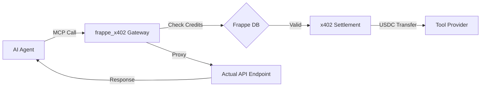

# frappe_x402: The Agentic Commerce Engine 🤖💰

[](https://frappeframework.com)
[](https://modelcontextprotocol.io)
[](https://x402.org)
[](https://opensource.org/licenses/MIT)

**Turn your APIs into revenue-generating AI tools in seconds.**

`frappe_x402` is a high-performance marketplace and economic gateway for the **Model Context Protocol (MCP)**. It enables developers to monetize their AI tools and APIs using the **x402 protocol**, allowing AI agents to discover, call, and pay for services autonomously.

---

## 🌟 Why frappe_x402?

In the age of AI Agents, the "Subscription Model" is dead. Agents need **Pay-per-Call** efficiency. This project bridges the gap between Web2 developers, AI Agents, and Web3 settlements.

*   **Invisible Crypto:** Users pay in Fiat (Razorpay/Stripe) and get internal credits. The backend settles in USDC via x402 automatically.
*   **MCP Native:** Built specifically for Anthropic’s Model Context Protocol.
*   **Frappe Powered:** Leverages the world’s most versatile metadata-driven framework for user management, audit logs, and multi-tenancy.
*   **Agent Safety:** Built-in governance with daily spending limits and tool whitelisting.

---

## 🚀 The Architecture



---

## 🛠 Features

- **The Marketplace:** A professional "App Store" UI inside the Frappe Desk for tool discovery.
- **Economic Interceptor:** Middleware that intercepts MCP calls to ensure payment before execution.
- **Hybrid Ledger:** Real-time internal credit tracking synced with on-chain USDC transactions.
- **Provider Dashboard:** A dedicated space for developers to track earnings, ratings, and call volume.
- **Fiat Bridge:** Built-in Razorpay integration for seamless INR top-ups.

---

## 📦 Installation

Install `frappe_x402` on your bench like any other Frappe app:

```bash
bench get-app https://github.com/nishanthabimanyu/frappe_x402.git
bench --site [your-site] install-app frappe_x402
bench migrate
```

### Optional: EVM Dependencies
To enable real USDC settlements (non-mock mode), install the EVM extras:
```bash
./env/bin/pip install "x402[evm]"
```

---

## 👨‍💻 For Tool Providers

Registering a tool is as simple as defining a DocType.
1.  Navigate to **MCP Provider** and register your profile with your USDC wallet.
2.  Create an **MCP Tool** entry with your endpoint URL and price per call.
3.  Your tool is now live and monetized on the `/api/method/frappe_x402.api.call_tool` endpoint.

---

## 🤝 Contributing

We love contributions! Whether it's adding a new payment gateway, improving the MCP proxy logic, or polishing the Vue.js frontend.

Please see [CONTRIBUTING.md](CONTRIBUTING.md) for guidelines.

---

## 🛡 License

This project is licensed under the MIT License - see the [LICENSE](LICENSE) file for details.

---

Built with ❤️ for the AI Agent Community by **Nishanth M**.
